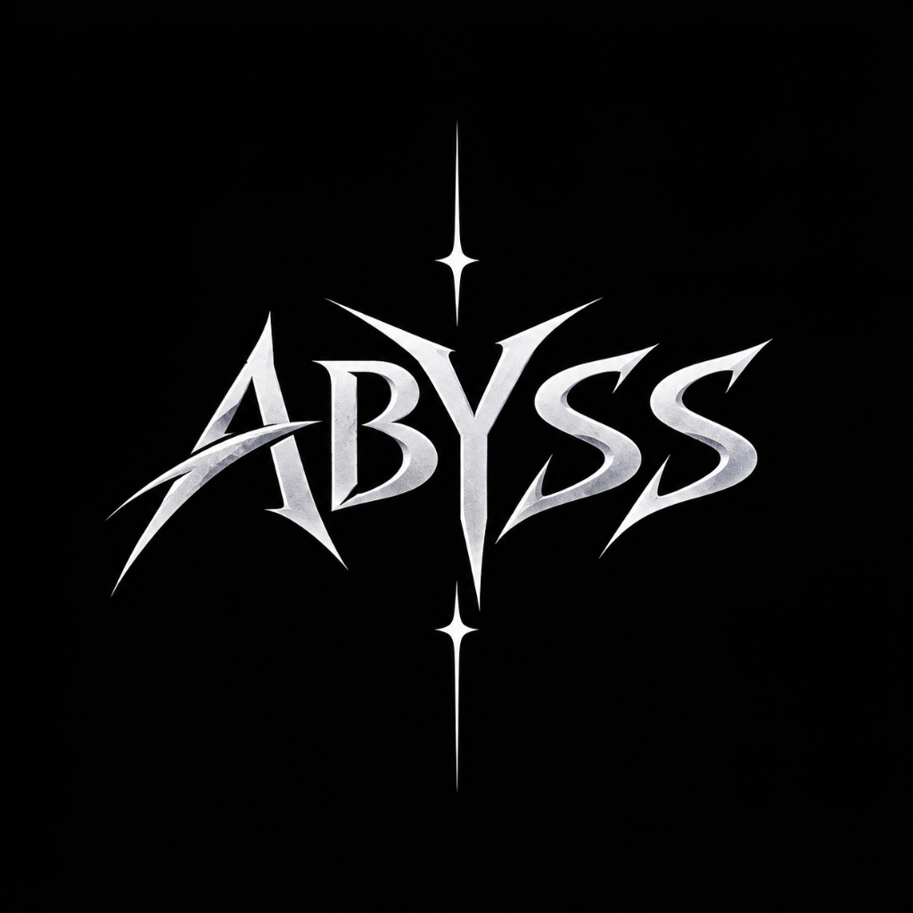

<p align="center">
  
</p>

# ⚡ ABYSS // Cyber-Deck Discord Bot & Command Console

> **Into the dark. Full autonomous server command.**

A high-performance Discord support, moderation, and utility bot paired with an **ultra-futuristic Cyber-Deck Web Console** (HUD interface with real-time WebSocket telemetry, live terminal log streaming, embed broadcasting, and remote controls).

---

## ✨ Features

### 🤖 Discord Bot Core
- **🎫 Interactive Ticket System**: Interactive button dispatch panel (`General Support`, `Technical Help`, `Report/Incident`), private encrypted ticket channels with locked permissions, staff claim buttons, and auto-generated transcripts.
- **📩 DM Support / Modmail**: Direct messages to the bot automatically route to dedicated staff support channels. Staff can reply directly via `?reply <text>` or through the Cyber-Deck web console.
- **🔊 "Join-to-Create" Dynamic Temp Voice Lounges**: Auto-creates private voice rooms when members join the VC hub channel and automatically cleans them up when empty. In-channel controls: `?vclock`, `?vcunlock`, `?vclimit`.
- **🛡️ Full Moderation Suite**: `?kick`, `?ban`, `?timeout`, `?clear`, `?warn`, `?lock`, `?unlock`.
- **💠 Telemetry & Utilities**: `?ping`, `?botinfo`, `?serverinfo`, `?userinfo`, `?say`.

### 💻 Cyber-Deck Web Console (`http://localhost:3000`)
- **Sci-Fi HUD Design**: Dark obsidian void with neon crimson & cyan accents, animated scanlines, holographic grids, and Web Audio synthesizer sound effects.
- **Live Terminal**: Real-time WebSocket log streaming with category filters (`ALL`, `DISCORD`, `TICKETS`, `MODMAIL`, `VC`, `SYSTEM`, `ERROR`) and interactive command prompt (`abyss@grid:~$`).
- **System Telemetry**: Real-time Gateway Ping, RAM allocation progress meter, active tickets & dynamic VC counters, and server stats.
- **Interactive Embed Studio**: Visual embed builder with live Discord card preview and 1-click broadcast to any server channel.
- **Direct Support Deck**: Real-time monitor of open tickets and modmail sessions with instant direct messaging.
- **Bot Presence Controller**: Change bot status (Online, Idle, DND) and custom activity text in real time.
- **Passcode Protected**: Secured by default with `cyber_admin_2026` (configurable in `.env`).

---

## 🚀 Quick Setup

### 1. Prerequisites
- [Node.js (LTS v18+)](https://nodejs.org/)

### 2. Installation
```bash
git clone https://github.com/xritx2-bit/DC-BOT.git
cd DC-BOT
npm install
```

### 3. Configuration
Copy `.env.example` to `.env` and fill in your credentials:
```ini
DISCORD_TOKEN=your_bot_token_here
CLIENT_ID=your_client_id_here
PORT=3000
CONSOLE_PASSWORD=cyber_admin_2026
```

> **Note:** Make sure you have enabled the 3 **Privileged Gateway Intents** (**Presence Intent**, **Server Members Intent**, **Message Content Intent**) on the [Discord Developer Portal](https://discord.com/developers/applications).

### 4. Run the Engine
- **Windows (1-Click)**: Double-click `start.bat`
- **Manual**:
```bash
npm start
```
Open your browser and navigate to `http://localhost:3000`.

---

## 📜 License
MIT License. Crafted with futuristic cyber aesthetics.
